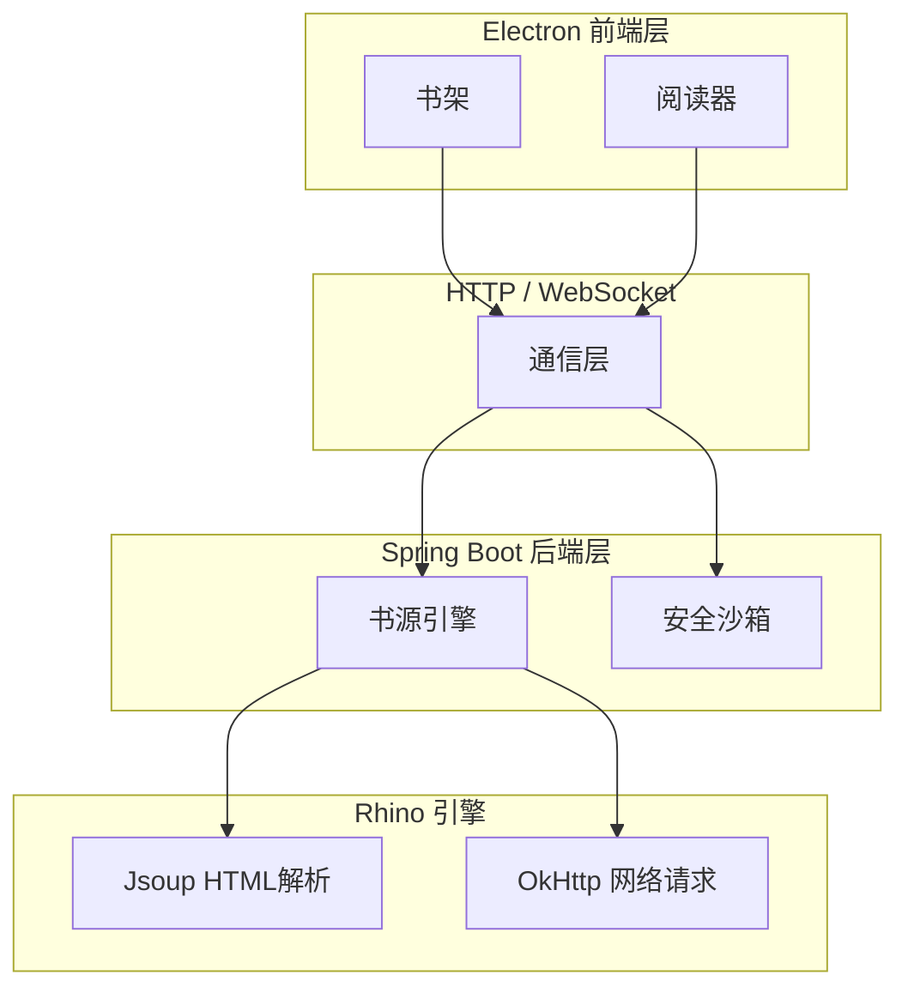

# 墨阅 (Moyue)

<div align="center">
  <p><strong>将 Legado 海量书源无缝带入桌面的跨平台阅读器</strong></p>
  <p>
    <a href="https://github.com/gncysy/moyue-reader/releases">
      
    </a>
    <a href="https://github.com/gncysy/moyue-reader/blob/main/LICENSE">
      
    </a>
    <a href="https://github.com/gncysy/moyue-reader/issues">
      
    </a>
    <a href="https://github.com/gncysy/moyue-reader/stargazers">
      
    </a>
  </p>
  <p>⭐️ 如果这个项目对你有帮助，欢迎 Star 支持！</p>
</div>

## 项目简介

墨阅是一个跨平台桌面阅读器，将 Android 开源阅读器 Legado 的核心功能重构为桌面应用。

项目采用前后端分离架构，后端基于 Spring Boot + Kotlin，前端基于 Electron + Vue 3。目标是在保持 Legado 书源生态兼容性的同时，提供更适合桌面端的阅读体验。

## 核心特点

- 📚 **书源兼容**：支持导入 Legado 格式书源，延续已有的阅读生态
- 🛡️ **安全沙箱**：提供标准/兼容/信任三级模式，用户可根据需求调节
- 🖥️ **桌面适配**：四种翻页模式、自定义主题，适配桌面端阅读习惯
- 🔄 **数据互通**：书源 JSON、备份文件可与 Legado 手机版互通
- 🚀 **跨平台**：支持 Windows / macOS / Linux

## 截图预览

> 截图准备中，敬请期待

| 书架 | 阅读器 | 书源管理 |
|------|--------|----------|
|  |  |  |

## 功能特性

### 书架管理
- 书籍增删改查
- 阅读进度自动同步
- 封面缓存与清理
- 自定义分组

### 书源系统
- 导入/导出 Legado 格式书源（JSON）
- 书源启用/禁用
- 书源测试与调试
- 兼容性分析（自动检测书源所需安全级别）

### 阅读器
- 四种翻页模式：覆盖、仿真、滑动、滚动
- 排版设置：字体、字号、行距、对齐方式
- 主题切换：日间、夜间、护眼
- 目录导航：快速跳转章节
- 书签管理：添加/删除书签

### 安全沙箱
| 模式 | 兼容性 | 限制 |
| --- | --- | --- |
| 标准模式 | ~85% | 禁止文件/Socket/反射，适合日常阅读 |
| 兼容模式 | ~95% | 允许文件/Socket，禁止反射，适合特殊书源 |
| 信任模式 | ~98% | 仅超时保护，需手动确认，适合开发者调试 |

### TTS 朗读
- 系统 TTS（Windows SAPI5 / macOS AVSpeech）
- 语速调节
- 后台播放

### WebDAV 同步
- 书架备份与恢复
- 阅读进度同步
- 手动/自动同步模式

### 本地书籍
- TXT：自动分章（正则匹配章节标题）
- EPUB：解析目录、封面、正文

## 系统架构



## 技术栈
### 后端

- Kotlin 1.9 + Spring Boot 3.2
- Rhino 1.7.15（与 Legado 同款 JavaScript 引擎）
- OkHttp + Jsoup（网络请求与 HTML 解析）
- H2 / SQLite（开发/生产数据库）

### 前端

- Electron 28（跨平台桌面应用框架）
- Vue 3.4 + TypeScript 5.3
- Element Plus（UI 组件库）
- Pinia（状态管理）
- Vue Router（路由管理）

## 快速开始

### 环境要求

- JDK 17 (Eclipse Temurin)
- Node.js 18+
- Git

### 克隆项目

```
git clone https://github.com/gncysy/moyue-reader.git
cd moyue-reader
```

### 启动后端
```
cd backend
./gradlew bootRun
```

### 启动前端
新开终端窗口，执行：
```
cd frontend
npm install
npm run electron:dev
```

## 下载安装

访问 https://github.com/gncysy/moyue-reader/releases 页面下载对应平台安装包：

- Windows：.exe
- macOS：.dmg
- Linux：.AppImage / .deb

## 贡献指南

欢迎提交 Issue 和 Pull Request。

1. Fork 本仓库
2. 创建特性分支 (git checkout -b feature/AmazingFeature)
3. 提交更改 (git commit -m 'feat: add feature')
4. 推送到分支 (git push origin feature/AmazingFeature)
5. 打开 Pull Request

## 贡献者

<a href="https://github.com/gncysy">
  
</a>
**gncysy** · 项目创建者、核心开发者  
GitHub: https://github.com/gncysy

<br clear="all"/>

## 致谢

感谢以下开源项目的支持：

· Legado - Android 开源阅读器
· Reader - 阅读3服务器版
· Rhino - JavaScript 引擎
· Electron
· Spring Boot
· Vue.js

## 许可证

GPL-3.0 License © 2026 墨阅团队

## 联系方式

- 问题反馈：https://github.com/gncysy/moyue-reader/issues
- 项目主页：https://github.com/gncysy/moyue-reader

---

<div align="center">
  <sub>✨ 如果墨阅对你有帮助，欢迎 Star ⭐️</sub>
</div>
