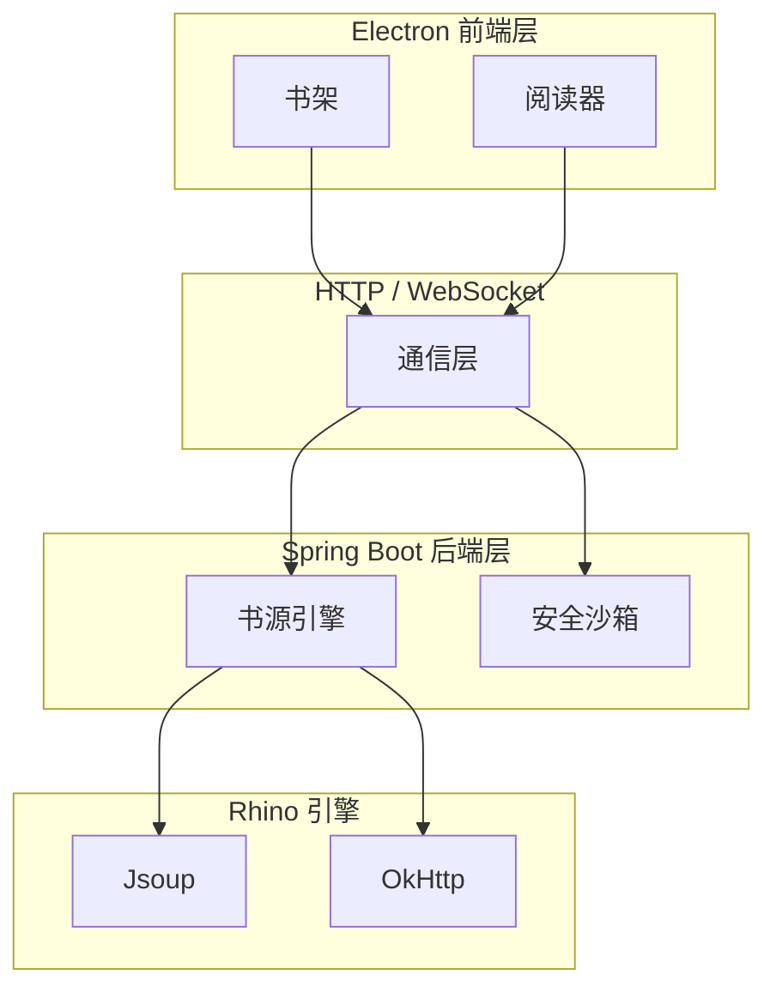

# 墨阅 (Moyue)

<div align="center">
  <p><strong>将 Legado 书源生态带到桌面的跨平台阅读器</strong></p>
  <p>
    <a href="https://github.com/gncysy/moyue-reader/releases">
      
    </a>
    <a href="https://github.com/gncysy/moyue-reader/blob/main/LICENSE">
      
    </a>
    <a href="https://github.com/gncysy/moyue-reader/issues">
      
    </a>
  </p>
</div>

## 项目简介

墨阅是一个跨平台桌面阅读器，将 Android 开源阅读器 Legado 的核心功能重构为桌面应用。项目采用前后端分离架构，后端基于 Spring Boot + Kotlin，前端基于 Electron + Vue 3。

目标是在保持 Legado 书源生态兼容性的同时，提供更精致的桌面端阅读体验。

## 截图预览

> 截图准备中，敬请期待

| 书架 | 阅读器 | 书源管理 |
|------|--------|----------|
|  |  |  |

## 功能特性

### 书架管理
- 书籍增删改查
- 阅读进度记录
- 封面缓存
- 分组管理

### 书源系统
- 导入/导出 Legado 格式书源（JSON）
- 书源启用/禁用
- 书源测试
- 兼容性分析

### 阅读器
- 四种翻页模式：覆盖、仿真、滑动、滚动
- 排版设置：字体、字号、行距
- 主题切换：日间、夜间、护眼
- 目录导航
- 书签

### 安全沙箱
| 模式 | 兼容性 | 限制 |
| --- | --- | --- |
| 标准模式 | ~85% | 禁止文件/Socket/反射 |
| 兼容模式 | ~95% | 允许文件/Socket，禁止反射 |
| 信任模式 | ~98% | 仅超时保护，需手动确认 |

### TTS 朗读
- 系统 TTS（Windows SAPI5 / macOS AVSpeech）
- 语速调节
- 后台播放

### WebDAV 同步
- 书架备份与恢复
- 阅读进度同步
- 手动/自动同步

### 本地书籍
- TXT：自动分章
- EPUB：解析目录、封面、正文

## 系统架构



### 启动后端
```bash
cd backend
./gradlew bootRun
```

### 启动前端
新开终端窗口，执行：
```bash
cd frontend
npm install
npm run electron:dev
```

## 下载安装

访问 https://github.com/gncysy/moyue-reader/releases 页面下载对应平台安装包：

- Windows：.exe
- macOS：.dmg
- Linux：.AppImage / .deb

## 贡献指南

欢迎提交 Issue 和 Pull Request。

1. Fork 本仓库
2. 创建特性分支 (git checkout -b feature/AmazingFeature)
3. 提交更改 (git commit -m 'feat: add feature')
4. 推送到分支 (git push origin feature/AmazingFeature)
5. 打开 Pull Request

## 致谢

感谢以下开源项目的支持：

- [Legado](https://github.com/gedoor/legado) - Android 开源阅读器，书源生态的核心
- [Reader](https://github.com/hectorqin/reader) - 阅读3服务器版
- [Rhino](https://github.com/mozilla/rhino) - JavaScript 引擎
- [Electron](https://www.electronjs.org/) - 跨平台桌面应用框架
- [Spring Boot](https://spring.io/projects/spring-boot) - Java 后端框架
- [Vue.js](https://vuejs.org/) - 前端框架

## 贡献者

<a href="https://github.com/gncysy">
  
</a>

## 许可证

GPL-3.0 License © 2024 墨阅团队

## 联系方式

- 问题反馈：https://github.com/gncysy/moyue-reader/issues
